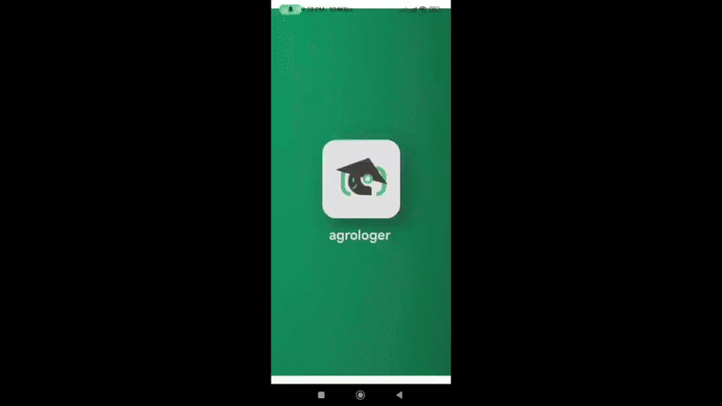

# Agrologer

Agrologer is a sophisticated agricultural monitoring and analysis system designed to leverage IoT devices and machine learning to provide real-time insights and recommendations for farmers. The project consists of multiple components including a mobile app, main server, socket server, ML models server, and device server.

## Demo

Below is a preview of the Mobile App in action:



## Prototype Link:

https://www.figma.com/proto/BWn4b0xT7XyJVAyTko3rYn/Agrologer?node-id=318-4954&node-type=frame&t=rTKW7ZGyn4xrWOTM-1&scaling=scale-down&content-scaling=fixed&page-id=62%3A132&starting-point-node-id=318%3A4954

## Figma Design

https://www.figma.com/design/BWn4b0xT7XyJVAyTko3rYn/Agrologer?node-id=62-132&t=IuIroL9roO7eP4Zt-1

## Download Agrologer

[](https://github.com/khalid999devs/Agrologer-nasa-space-app/releases/download/v1.0.0/Agrologer.apk)

You can download the latest version of the Agrologer app by clicking the button above or using the following link:

[Download Agrologer APK](https://github.com/khalid999devs/Agrologer-nasa-space-app/releases/download/v1.0.0/Agrologer.apk)

## Table of Contents

- [Project Overview](#project-overview)
- [System Design](#system-design)
- [Folder Structure](#folder-structure)
- [Environment Configuration](#environment-configuration)
- [How to Run Locally](#how-to-run-locally)
  - [Running the Node.js Express Server (Main Server)](#1-running-the-nodejs-express-server-main-server)
  - [Running the Python Machine Learning Models Server](#2-running-the-python-machine-learning-models-server)
  - [Running the React Native (Expo) Mobile App](#3-running-the-react-native-expo-mobile-app)
  - [Running the Node.js Socket Server](#4-running-the-nodejs-socket-server)

## Project Overview

Agrologer aims to provide a comprehensive solution for agricultural management by integrating sensor data, machine learning predictions, and user interaction through a mobile app. The system is designed to be scalable, efficient, and user-friendly, ensuring that farmers can make data-driven decisions to optimize their crop yield and resource usage.

## System Design

The Agrologer system is composed of several interconnected components as illustrated in the system design diagram below.


### Components:

- **User (Mobile App)**: Interface for farmers to interact with the system.
- **Main Server**: Handles core application logic and communication.
- **Socket Server**: Manages real-time data communication between devices.
- **ML Models Server**: Performs machine learning predictions and analysis.
- **Device Server**: Collects and processes data from various sensors.
- **Redis**: In-memory data structure store for fast data access.
- **PostgreSQL**: Database for persistent storage of system data.

## Folder Structure

The project is organized as follows:

```plaintext
NASA_SPACE_APP_AGROLOGER/
├── client/          # React Native app (mobile)
├── modelServer/          # Python ML models server
├── server/          # Node.js Express server (main)
├── socket/          # Node.js WebSocket server
├── Agrolzyer.ino    # IoT device code
├── README.md        # Project documentation
└── SystemDesign.png # System architecture diagram
```

## Environment Configuration

Each component of the Agrologer system relies on environment variables to manage configuration settings. Below are the required `.env` files for each part of the system:

### 1. Main Server (`server/.env`)

```plaintext
NODE_ENV=development
PORT=8001
CLIENT_SECRET=your_client_secret
REMOTE_CLIENT_APP=your_remote_client_app
DB_USER=your_database_user
DB_PASS=your_database_password
DB_NAME=your_database_name
DB_HOST=your_database_host
SERVER_EMAIL=your_server_email@example.com
MAIL_PASS=your_email_password
MAIL_HOST=smtp.your_email_provider.com
AUTHORITY_EMAIL=authority_email@example.com
TWILIO_ACCOUNT_SID=your_twilio_account_sid
TWILIO_AUTH_TOKEN=your_twilio_auth_token
TWILIO_SERVICE_SID=your_twilio_service_sid
REDIS_URL=your_redis_url
```

### 2. Machine Learning Models Server (`modelServer/.env`)

```plaintext
SECRET_KEY=your_secret_key
DATABASE_URL=your_database_url
FLASK_ENV=development
```

### 3. Socket Server (`socket/.env`)

```plaintext
CLIENT_SECRET=your_client_secret
```

### 4. Mobile App (`client/.env`)

```plaintext
EXPO_PUBLIC_SERVER_URI=your_server_uri
EXPO_PUBLIC_GMAP_API_KEY=google_console_google_map_api_key
```

> **Note:** Ensure that the `.env` files are properly configured with the actual values for each variable before running the servers.

## How to Run Locally

### 1. Running the Node.js Express Server (Main Server)

To run the Node.js Express server:

1. Open a terminal and navigate to the `server/` directory.
2. Install the necessary dependencies:

   ```bash
   npm install
   ```

3. Start the server:

   ```bash
   npm start
   ```

This will launch the Express server, typically accessible at `http://localhost:8001`.

---

### 2. Running the Python Machine Learning Models Server

To run the machine learning models server:

1. Open a terminal and navigate to the `modelServer/` directory.
2. Activate your Python virtual environment (if you haven’t created one, you can do so with `python -m venv venv`):

   - On Linux/macOS:

     ```bash
     source venv/bin/activate
     ```

   - On Windows:

     ```bash
     .\venv\Scripts\activate
     ```

3. Install the required Python packages:

   ```bash
   pip install -r requirements.txt
   ```

4. Start the server:

   ```bash
   python app.py
   ```

The Python server will be accessible at `http://localhost:5001`.

---

### 3. Running the React Native (Expo) Mobile App

To run the mobile app using Expo:

1. Open a terminal and navigate to the `client/` directory.
2. Install the necessary dependencies:

   ```bash
   npm install
   ```

3. Ensure you have Expo CLI installed globally:

   ```bash
   npm install -g expo-cli
   ```

4. Start the Expo server:

   ```bash
   expo start
   ```

This will open the Expo Developer Tools in your browser. You can run the app on a physical device via the **Expo Go** app or use an emulator.

---

### 4. Running the Node.js Socket Server

To start the Socket server:

1. Open a terminal and navigate to the `socket/` directory.
2. Install dependencies:

   ```bash
   npm install
   ```

3. Start the server:

   ```bash
   npm start
   ```

This will start the WebSocket server, typically accessible at `ws://localhost:3000`.

---

### 5. Setting up PostgreSQL with pgAdmin4

To set up PostgreSQL with pgAdmin4 for Agrologer:

1. **Install PostgreSQL and pgAdmin4**:

   - Download and install PostgreSQL from the [official website](https://www.postgresql.org/download/).
   - Download and install pgAdmin4 from the [pgAdmin website](https://www.pgadmin.org/download/).

2. **Create a PostgreSQL Database**:

   - Open pgAdmin4 and connect to your local PostgreSQL server.
   - Right-click on the "Databases" node and select "Create" → "Database".
   - Name the database (e.g., `agrologer_db`).

3. **Set up a Database User**:

   - Under the "Login/Group Roles" node, create a new user (e.g., `agrologer_user`).
   - Assign a password and ensure the user has the necessary privileges (e.g., `CREATE`, `CONNECT`, `SELECT`, etc.).

4. **Configure Connection in `.env`**:

   - Update your `server/.env` file with the following variables based on your PostgreSQL setup:

     ```plaintext
     DB_USER=agrologer_user
     DB_PASS=your_password
     DB_NAME=agrologer_db
     DB_HOST=localhost
     ```

5. **Migrate Database**:
   - If you are using an ORM like Sequelize or TypeORM, ensure that you run migrations to set up your database schema.

---

By following these steps, you can successfully run each part of the Agrologer system on your local machine and set up PostgreSQL with pgAdmin4 for database management.
