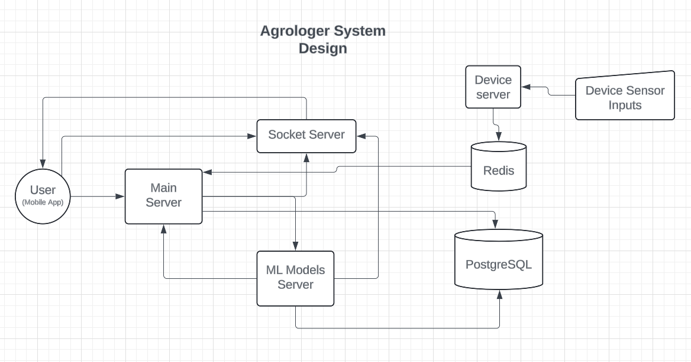

# Agrologer

Agrologer is a sophisticated agricultural monitoring and analysis system designed to leverage IoT devices and machine learning to provide real-time insights and recommendations for farmers. The project consists of multiple components including a mobile app, main server, socket server, ML models server, and device server.

## Table of Contents

- [Project Overview](#project-overview)
- [System Design](#system-design)
- [Folder Structure](#folder-structure)
- [How to Run Locally](#how-to-run-locally)
  - [Running the Node.js Express Server (Main Server)](#1-running-the-nodejs-express-server-main-server)
  - [Running the Python Machine Learning Models Server](#2-running-the-python-machine-learning-models-server)
  - [Running the React Native (Expo) Mobile App](#3-running-the-react-native-expo-mobile-app)
  - [Running the Node.js Socket Server](#4-running-the-nodejs-socket-server)

## Project Overview

Agrologer aims to provide a comprehensive solution for agricultural management by integrating sensor data, machine learning predictions, and user interaction through a mobile app. The system is designed to be scalable, efficient, and user-friendly, ensuring that farmers can make data-driven decisions to optimize their crop yield and resource usage.

## System Design

The Agrologer system is composed of several interconnected components as illustrated in the system design diagram below.



### Components:

- **User (Mobile App)**: Interface for farmers to interact with the system.
- **Main Server**: Handles core application logic and communication.
- **Socket Server**: Manages real-time data communication between devices.
- **ML Models Server**: Performs machine learning predictions and analysis.
- **Device Server**: Collects and processes data from various sensors.
- **Redis**: In-memory data structure store for fast data access.
- **PostgreSQL**: Database for persistent storage of system data.

## Folder Structure

The project is organized as follows:

```plaintext
NASA_SPACE_APP_AGROLOGER/
├── client/          # React Native app (mobile)
├── modelServer/          # Python ML models server
├── server/          # Node.js Express server (main)
├── socket/          # Node.js WebSocket server
├── Agrolzyer.ino    # IoT device code
├── README.md        # Project documentation
└── SystemDesign.png # System architecture diagram
```

## How to Run Locally

### 1. Running the Node.js Express Server (Main Server)

To run the Node.js Express server:

1. Open a terminal and navigate to the `server/` directory.
2. Install the necessary dependencies:

   ```bash
   npm install
   ```

3. Start the server:

   ```bash
   npm start
   ```

This will launch the Express server, typically accessible at `ws://localhost:8001`.

---

### 2. Running the Python Machine Learning Models Server

To run the machine learning models server:

1. Open a terminal and navigate to the `modelServer/` directory.
2. Activate your Python virtual environment (if you haven’t created one, you can do so with `python -m venv venv`):

   - On Linux/macOS:

     ```bash
     source venv/bin/activate
     ```

   - On Windows:

     ```bash
     .\venv\Scripts\activate
     ```

3. Install the required Python packages:

   ```bash
   pip install -r requirements.txt
   ```

4. Start the server:

   ```bash
   python app.py
   ```

The Python server will be accessible at `http://localhost:5001`.

---

### 3. Running the React Native (Expo) Mobile App

To run the mobile app using Expo:

1. Open a terminal and navigate to the `client/` directory.
2. Install the necessary dependencies:

   ```bash
   npm install
   ```

3. Ensure you have Expo CLI installed globally:

   ```bash
   npm install -g expo-cli
   ```

4. Start the Expo server:

   ```bash
   expo start
   ```

This will open the Expo Developer Tools in your browser. You can run the app on a physical device via the **Expo Go** app or use an emulator.

---

### 4. Running the Node.js Socket Server

To start the Socket server:

1. Open a terminal and navigate to the `socket/` directory.
2. Install dependencies:

   ```bash
   npm install
   ```

3. Start the server:

   ```bash
   npm start
   ```

This will start the WebSocket server, typically accessible at `ws://localhost:3000`.

---

By following these steps, you can successfully run each part of the Agrologer system on your local machine.
